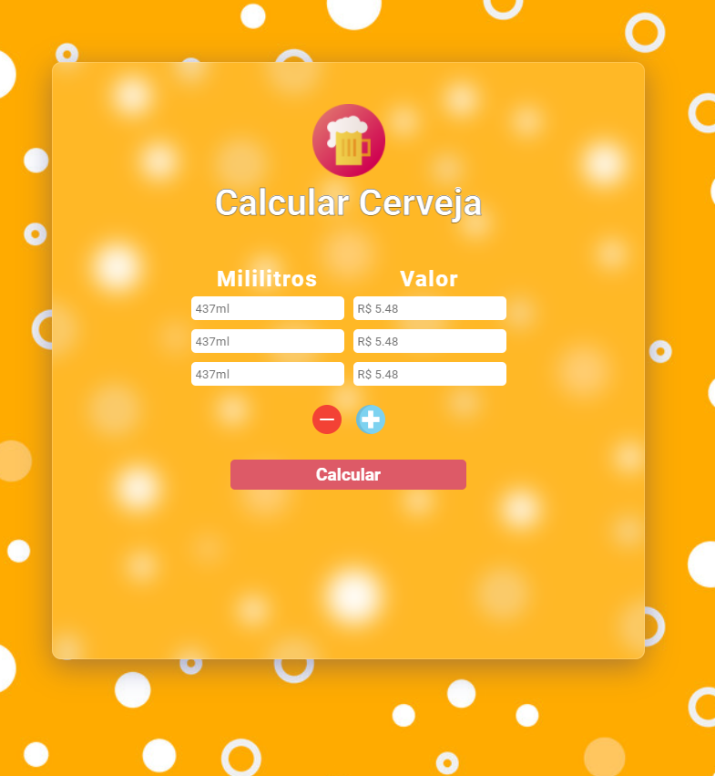

# Calculadora Cerveja

Este projeto foi produzido por mim e pelo Pablo Veronezi após um fato ocorrido dentro de um supermercado, onde precisavamos verificar qual era a melhor opção diante várias do mercado. 

O projeto foi desenvolvido utilizando apenas HTML, CSS e Javascript, afim de melhorar nossos conhecimentos dentro da linguagem e do frontend.

## Imagens do Projeto

